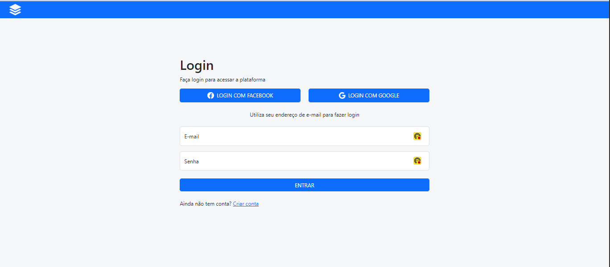
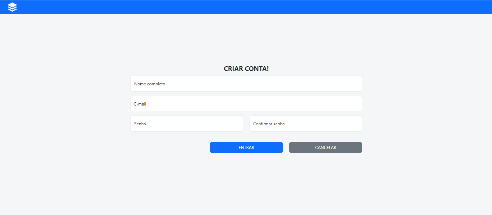
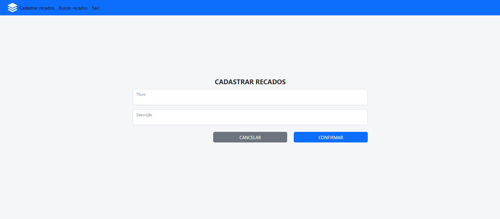

<H1>Consumo de API de recados</H1>

Este repositório faz o consumo da <a href="https://github.com/Leokrindges/back_API_lista_de_recados" target="_blank" rel="noopener noreferrer">api de Recados</a> desenvolvida por mim também na formação de devs full stack da GrowDev.

Tela de login

    

Tela de criar usuário

    

Tela de criar recado

    

